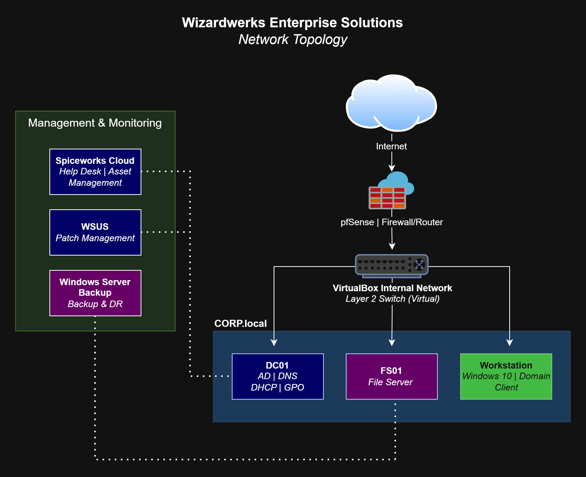

# 🧙 Wizardwerks Enterprise Solutions — Home Lab

---

## Overview

This repository documents the **Wizardwerks Enterprise Solutions home lab** — a fully functional Windows enterprise environment built from the ground up to demonstrate real-world IT infrastructure capability.

This is not a tutorial project. This is a working environment — designed, deployed, and administered the same way it would be in a production business setting. Every service configured here reflects the kind of infrastructure that keeps organizations running.

---

## Why I Built This

Certifications tell you what someone knows. A lab tells you what someone can actually do.

I built Wizardwerks because I wanted a tangible, living proof of my skills as a systems administrator — something I could point to and say *I built that, I maintain that, and I know exactly how it works and why*. Every component in this environment was researched, planned, configured, tested, and documented by hand.

This lab is also a platform. It grows as I grow — and the roadmap is ambitious.

---

## Network Topology

---

## Current Infrastructure

| Component | Technology | Status |
|---|---|---|
| Hypervisor | Oracle VM VirtualBox | ✅ Complete |
| Domain Controller | Windows Server 2022 — AD, DNS, DHCP, GPO | ✅ Complete |
| File Server | Windows Server 2022 — NTFS, Shared Drives | ✅ Complete |
| Endpoint Simulation | Windows 10 Workstation VM | ✅ Complete |
| Network Firewall | pfSense CE — Firewall, Routing, VLANs | 🔄 In Progress |
| Backup & DR | Veeam Backup & Replication Community Edition | 🔄 In Progress |
| Patch Management | WSUS — Windows Server Update Services | 📋 Planned |
| Help Desk | Spiceworks Cloud — Full ticket lifecycle | ✅ Complete |
| Automation | PowerShell — User provisioning scripts | ✅ Complete |

---

## PowerShell Automation

Two production-grade provisioning scripts handle the full user onboarding workflow:

### `NewUser.ps1` — Single User Provisioning
- Interactive prompts with full confirmation gate before any changes are made
- AD account creation, OU placement, security group assignment
- Home directory creation with scoped NTFS permissions
- H: drive mapping via AD user profile
- Try/Catch error handling with step-level failure reporting

### `BulkProvision.ps1` — CSV Bulk Provisioning
- Reads from a structured CSV file and processes any number of users
- Full provisioning workflow applied per user in sequence
- Real-time per-user SUCCESS / FAILED output during execution
- Final summary count on completion
- **Tested:** 6-user Justice League dataset — 6/6 SUCCESS ✅

---

## Active Directory Architecture

- **Domain:** CORP.local
- **Organizational Units:** HR | IT | Sales
- **Security Groups:** HR_Users | IT_Users | Sales_Users
- **Group Policy:** Drive mapping GPO deployed and verified across all OUs
- **RBAC:** Department shares accessible only to corresponding security groups
- **Home Directories:** Auto-provisioned per user via PowerShell, mapped to H: drive

---

## Roadmap

This environment is actively expanding. Planned additions include:

- ☁️ **Azure Entra ID Connect** — hybrid identity sync between on-prem AD and Azure AD
- ☁️ **Oracle Cloud Free Tier** — extend the lab into the cloud
- 🔐 **Duo MFA** — multi-factor authentication integration
- 🔄 **WSUS** — centralized patch management with staged rollout groups
- 💾 **Veeam DR Testing** — verified backup and restore capability
- 🌐 **pfSense VLAN Segmentation** — full network segmentation with firewall rules

The goal is a fully documented, cloud-integrated, security-hardened enterprise environment — built and operated by one administrator.

---

## Documentation

Full technical documentation is included in this repository — covering every VM, every service, every configuration decision, and every command. Written to the standard of a real enterprise IT runbook.

📄 [`Wizardwerks_Tech_Doc.pdf`](Wizardwerks_Tech_Doc.pdf)

---

## About

**James Mitchell** — Systems Administrator  
Experienced in enterprise Windows infrastructure, Active Directory, PowerShell automation, network administration, and IT operations. Background in military IT (U.S. Army), public safety, and small business systems administration.

Building toward a Senior IT role — one documented, tested, production-grade lab component at a time.

---

*Small operation. Enterprise results.*

